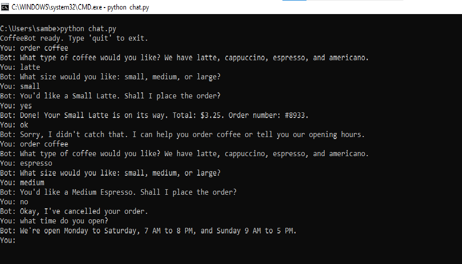

# CoffeeBot: A Chatbot Built with Amazon Lex V2

CoffeeBot is a conversational chatbot built on **Amazon Lex V2** and **AWS Lambda**. It takes coffee orders, answers store-hours questions, and handles anything else with a friendly fallback. Orders are fulfilled by a Lambda function that calculates the price and returns an order number.



## Features

- **Order coffee:** collects the coffee type and cup size, confirms the order, then fulfills it through Lambda
- **Store hours:** answers questions such as "What time do you open?"
- **Fallback handling:** replies helpfully when it doesn't understand
- **Order cancellation:** if the user declines at the confirmation step, the order is cancelled
- **Python client:** a command-line chat client that calls the bot through the Lex runtime API

## Architecture

```
User (CLI / app / channel)
        |
        v
Amazon Lex V2   (intents, slots, natural language understanding)
        |  fulfillment hook
        v
AWS Lambda      (pricing and order logic)
        |
        v
CloudWatch Logs (debugging)
```

## AWS Services Used

| Service | Purpose |
|---|---|
| Amazon Lex V2 | Intent recognition, slot filling, conversation flow |
| AWS Lambda | Order fulfillment logic |
| Amazon CloudWatch | Lambda logs for debugging |
| AWS IAM | Permissions for Lex and Lambda, and credentials for the client |

## Bot Design

**Intents**

| Intent | Purpose |
|---|---|
| `OrderCoffee` | Collects `CoffeeType` and `Size`, confirms, then fulfills via Lambda |
| `StoreHours` | Returns the opening hours |
| `FallbackIntent` | Handles unrecognized input |

**Custom slot types** (both set to *Restrict to slot values*)

| Slot type | Values | Synonyms |
|---|---|---|
| `CoffeeType` | Latte, Cappuccino, Espresso, Americano | caffe latte, cap, shot, black coffee |
| `CupSize` | Small, Medium, Large | tiny, regular (for Small) |

**Pricing** (calculated in Lambda)

| Size | Base price |
|---|---|
| Small | $2.50 |
| Medium | $3.25 |
| Large | $4.00 |

Extras: Latte and Cappuccino +$0.75, Espresso +$0.25, Americano +$0.00.

## Project Structure

```
coffeebot-lex/
├── lambda/
│   └── lambda_function.py   # Fulfillment function
├── client/
│   └── chat.py              # Command-line chat client
├── bot-export/              # Exported Lex bot (optional)
├── screenshots/             # Images used in this README
├── README.md
└── .gitignore
```

## Setup

### Prerequisites

- An AWS account (check current Lex and Lambda pricing; light use is inexpensive)
- Python 3.9 or later
- AWS CLI installed and configured (`aws configure`)

### Option A: Import the exported bot

If `bot-export/` contains the exported zip:

1. Open the Amazon Lex console and choose **Bots → Actions → Import**.
2. Upload the zip and finish the import, then click **Build**.
3. Continue with the Lambda steps below.

### Option B: Build the bot manually

1. Create a blank Lex V2 bot named `CoffeeBot` (English US, text only).
2. Create the `CoffeeType` and `CupSize` slot types listed above. Every value and synonym must be unique within a slot type, and a synonym should not repeat its own value.
3. Create the `OrderCoffee` intent with sample utterances such as:
   - `I want to order a coffee`
   - `I want a {Size} {CoffeeType}`
   - `Can I get a {Size} {CoffeeType}`
   - `I'd like a {CoffeeType}`
   - `{Size} {CoffeeType}`
4. Add the slots `CoffeeType` and `Size`, and a confirmation prompt: `You'd like a {Size} {CoffeeType}. Shall I place the order?`
5. Create the `StoreHours` intent with utterances like `What time do you open` and a closing response with your hours.
6. Set the `FallbackIntent` closing response to a helpful message.

### Deploy the Lambda function

1. In the Lambda console, create a function named `CoffeeBotFulfillment` (Python 3.12, x86_64).
2. Paste in the contents of `lambda/lambda_function.py` and click **Deploy**.

### Connect Lambda to Lex

1. In Lex, open **Aliases**, choose your alias (or `TestBotAlias` for the draft), then open **English (US)**.
2. Under **Lambda function**, select `CoffeeBotFulfillment` and `$LATEST`, then **Save**.
3. Open the `OrderCoffee` intent, turn on the **Fulfillment** toggle, click **Save intent**, then **Build**.
4. To use a numbered alias such as `dev` or `prod`, create a new bot version **after** the steps above, associate it with the alias, and re-check that the Lambda function is still attached under **English (US)**.

## Running the Client

Install the dependency:

```
pip install boto3
```

Set your configuration (Windows Command Prompt):

```
set AWS_REGION=your-region
set LEX_BOT_ID=your-bot-id
set LEX_ALIAS_ID=your-alias-id
python client\chat.py
```

On macOS or Linux, use `export` instead of `set`.

| Variable | Description |
|---|---|
| `AWS_REGION` | Region the bot is deployed in (default `us-east-1`) |
| `LEX_BOT_ID` | Bot ID from the Lex console |
| `LEX_ALIAS_ID` | Alias ID, for example your `dev` alias or `TSTALIASID` for the draft |
| `LEX_LOCALE_ID` | Locale (default `en_US`) |

Example conversation:

```
CoffeeBot ready. Type 'quit' to exit.
You: order coffee
Bot: What type of coffee would you like? We have latte, cappuccino, espresso, and americano.
You: latte
Bot: What size would you like: small, medium, or large?
You: small
Bot: You'd like a Small Latte. Shall I place the order?
You: yes
Bot: Done! Your Small Latte is on its way. Total: $3.25. Order number: #8933.
```

## Lessons Learned

Issues hit while building this project, and how to avoid them:

- **Slot values must be unique.** Lex rejects a build if a value or synonym appears twice in the same slot type, ignoring case. List only the extra synonyms, not the value itself.
- **Bot versions are frozen snapshots.** Turning on fulfillment in the draft does not change an existing version. Create a new version and re-associate the alias.
- **Lambda is attached per alias and language.** It lives under *Alias → English (US)*, not on the alias summary page. Check it again after associating a new version.
- **Fulfillment must be switched on per intent.** Without the **Fulfillment** toggle, Lex returns the intent's closing response and never calls Lambda.
- **Sample utterances drive slot filling.** Include utterances that contain slots (`I want a {Size} {CoffeeType}`) so one-sentence orders work.
- **Use `TestBotAlias` while iterating.** It points at the draft, so each build is immediately testable without creating versions.
- **Read the error text.** Messages such as "doesn't have an associated Lambda Function" name the alias in question, which quickly shows when a script is calling the wrong alias.

## Troubleshooting

| Symptom | Likely cause |
|---|---|
| "Your order has been placed!" instead of the price | Alias points to a version without fulfillment, or Lambda isn't attached |
| `doesn't have an associated Lambda Function` | Attach the function under *Alias → English (US)* for that alias |
| `Invalid Lambda Response` | Lambda response is missing `sessionState`, or the intent state is wrong |
| `ResourceNotFoundException` | Wrong bot ID, alias ID or region |
| `AccessDeniedException` | The IAM user needs `lex:RecognizeText` permission |
| `NoCredentialsError` | Run `aws configure` |
| No log streams in CloudWatch | Lambda was never invoked |

## Security

- Never commit AWS access keys, secret keys, or `.env` files. Credentials set by `aws configure` live in your home directory (`~/.aws`), outside this repository.
- If a key is ever exposed, deactivate it immediately in **IAM → Security credentials**.
- Avoid including account IDs in screenshots.

## Clean Up

To avoid charges when you're finished:

1. Delete the Lex bot (remove aliases and versions first if prompted).
2. Delete the `CoffeeBotFulfillment` Lambda function.
3. Delete the CloudWatch log group `/aws/lambda/CoffeeBotFulfillment`.
4. Delete the IAM roles the console created for this project, and any unused access keys.

## Future Improvements

- Store orders in DynamoDB
- Send order confirmations with SNS or SES
- Add slot validation with a dialog code hook (for example, sold-out items)
- Add intents such as `CheckOrderStatus`, `CancelOrder` and `MenuInfo`
- Add a web front end using API Gateway and Lambda, or the Amazon Lex Web UI project
- Integrate with Slack, Twilio SMS or Facebook Messenger through Lex channel integrations
- Review conversation logs and analytics to find missed utterances

## License

Add a license of your choice (for example MIT) before sharing the project publicly.
